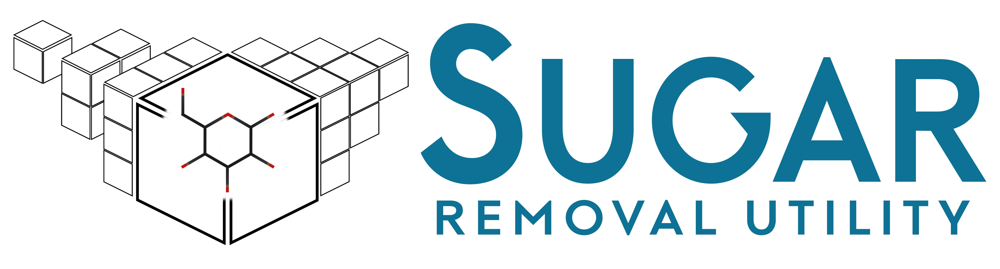

# Sugar Removal Utility (SRU)
##### An algorithmic approach for <i>in silico</i> removal of circular and linear sugars from molecular structures
##### [GitHub Repository](https://github.com/JonasSchaub/SugarRemoval/)

## Contents of this document
* [Overview](#Overview)
* [Contents of this repository](#Contents-of-this-repository)
  * [Sources](#Sources)
  * [SugarRemovalUtility CMD App](#SugarRemovalUtility-CMD-App)
  * [Natural product test sets](#Natural-product-test-sets)
* [Installation](#Installation)
  * [Command line application JAR](#Command-line-application-JAR)
  * [Source code](#Source-code)
* [Dependencies](#Dependencies)
* [References and useful links](#References-and-useful-links)

## Overview
* The Sugar Removal Utility (SRU), an algorithmic approach for <i>in silico</i> 
removal of circular and linear sugars from molecular structures, is described in this scientific publication: [Schaub, J., Zielesny, A., Steinbeck, 
C. et al. Too sweet: cheminformatics for deglycosylation in natural products. J Cheminform 12, 67 (2020)](https://doi.org/10.1186/s13321-020-00467-y). There, 
you can find all necessary details about the algorithm and its various configuration options. We also published a 
[follow-up article](https://doi.org/10.3390/biom11040486) where we used the SRU to analyse sugar moieties in the 
Collection of Open Natural products (COCONUT) database. Recently, we also developed an extension called Sugar Detection 
Utility (SDU) which is described here, for now: [https://github.com/cdk/cdk/pull/1225](https://github.com/cdk/cdk/pull/1225).
* This repository *used to* host the SRU source code, but it has now moved to the 
<a href="https://github.com/cdk/cdk">Chemistry Development Kit (CDK)</a> Java library for cheminformatics. If you want to 
use the SRU as a Java library, you now need to use the CDK version 2.10 or higher. Information on how to install and use
the CDK can be found in the GitHub repository linked above. You can then use the SRU via CDK's 
[SugarRemovalUtility class](https://github.com/cdk/cdk/blob/main/misc/extra/src/main/java/org/openscience/cdk/tools/SugarRemovalUtility.java)
or the [SugarDetectionUtility extension](https://github.com/cdk/cdk/blob/main/misc/extra/src/main/java/org/openscience/cdk/tools/SugarDetectionUtility.java).
* This repository now only hosts the SRU command-line application and its source code and it serves as a place for 
documentation about the algorithm.
* The SRU's functionalities can also be used in other software tools:
  * The SRU web application is available at [https://sugar.naturalproducts.net](https://sugar.naturalproducts.net) and its source code
    can be found [here](https://github.com/mSorok/SugarRemovalWeb).
  * The Sugar Removal/Detection Utility is also available in the open Java rich client application MORTAR ('MOlecule fRagmenTation 
  fRamework') where <i>in silico</i> molecule fragmentation can be easily conducted on a given data set and the results 
  visualised ([MORTAR GitHub repository](https://github.com/FelixBaensch/MORTAR) 
  | [MORTAR article](https://doi.org/10.1186/s13321-022-00674-9))
  * The SRU can also be accessed via an API call through the Cheminformatics Microservice 
  ([CM article](https://doi.org/10.1186/s13321-023-00762-4) | 
  [documentation of public instance](https://api.naturalproducts.net/latest/docs#/tools))
* Every software tool listed above is open and free (of charge) to use!
* The repository [wiki](https://github.com/JonasSchaub/SugarRemoval/wiki) contains code examples and some additional notes on sugar 
moiety detection and removal using the SRU.

## Contents of this repository
### Sources
The sources available in <i>/src/main/java/de/unijena/cheminf/deglycosylation/</i> belong to the SRU command-line
application. It makes the various settings for fine-tuning the sugar detection and removal process available through
command-line arguments. But using the CDK <i>SugarRemovalUtility / SugarDetectionUtility</i> classes directly in your 
own software project offers some additional configuration options and functionalities:
* Adding and removing circular and linear sugar patterns for the initial detection steps
* Sugar detection without removal
* Detecting only the number of sugar moieties of a molecule

The class <i>SugarRemovalUtilityTest</i> can be found in the directory
<i>/src/test/java/de/unijena/cheminf/deglycosylation/</i>. It is a JUnit test class that tests the performance of the
Sugar Removal Utility on multiple specific molecular structures of natural products hand-picked from public databases
(see article linked above). Code examples of how to use and configure the <i>SugarRemovalUtility</i> class can be found here.
There is also an analogous test class for the <i>SugarDetectionUtility</i>.

### SugarRemovalUtility CMD App
The sub-folder ["SugarRemovalUtility CMD App"](https://github.com/JonasSchaub/SugarRemoval/tree/main/SugarRemovalUtility%20CMD%20App) 
contains the sugar removal command-line application downloadable as 
Java archive. The JAR file "SugarRemovalUtility-jar-with-dependencies.jar" can be executed
from the command-line using Java version 17 or higher. A detailed explanation how to use the application can be found in
"Usage instructions.txt". Also, an example input file is provided, named "smiles_test_file.txt".

### Natural product test sets
The [test resources folder](https://github.com/JonasSchaub/SugarRemoval/blob/main/src/test/resources/) contains the
<i>review_glycosylated_NPs_bacteria_data.sdf</i> file which was published and provided by 
[Elshahawi et al. (2015)](https://doi.org/10.1039/C4CS00426D) and contains bacterial glycosylated natural products used
for testing the SRU algorithm (see SRU paper linked above).
 The text file "hand_picked_np.txt" contains a list of SMILES codes serving as a natural product test set for the 
performance of the Sugar Removal Utility. They were hand-picked from public databases via the 
[COlleCtion of Open NatUral producTs (COCONUT)](https://coconut.naturalproducts.net). More details can be found in the 
test class (see below) and the [Sugar Removal Utility publication](https://doi.org/10.1186/s13321-020-00467-y).

## Installation
As stated above, the Sugar Removal Utility is now part of the 
<a href="https://github.com/cdk/cdk">Chemistry Development Kit</a>. So, if you are already using CDK, you do not need to 
install the SRU externally, you can use it via CDK's SugarRemovalUtility class. If not, please follow the installation
description in the CDK repository linked above.
 
The Sugar Removal Utility web application in *this* repository is hosted as a package/artifact on the sonatype maven 
central repository. See the [artifact page](https://central.sonatype.com/artifact/io.github.jonasschaub/sru/) for installation guidelines using build tools like maven or gradle.
To install it via its JAR archive, you can get it from the [releases](https://github.com/JonasSchaub/SugarRemoval/releases). 
Note that other dependencies will need to be installed via JAR archives as well this way.

### Command line application JAR
The command-line application JAR has to be downloaded. After that, it can be executed from the command-line
as described in the usage instructions. Java version 17 or higher has to be installed on your machine.

### Source code
This is a Maven project. In order to use the source code for your own software, download or clone the repository and 
open it in a Maven-supporting IDE (e.g. IntelliJ) as a Maven project and execute the pom.xml file. Maven will then take
care of installing all dependencies.

## Dependencies
**Needs to be pre-installed:**
* Java Development Kit (JDK) version 17 or higher
  * [Adoptium OpenJDK](https://adoptium.net) (as one possible source of the JDK)
  * Eclipse Public License v2.0
* Apache Maven version 4
  * [Apache Maven](https://maven.apache.org/download.cgi#alpha-4-x-release)
  * Apache License, version 2.0

**Managed by Maven:**
* Chemistry Development Kit (CDK) version 2.12-SNAPSHOT
  * [Chemistry Development Kit on GitHub](https://cdk.github.io/)
  * License: GNU Lesser General Public License 2.1
* JUnit version 5.10.0
  * [JUnit 5](https://junit.org/junit5/)
  * License: Eclipse Public License v2.0
* Apache Commons CLI version 1.4
    * [Apache Commons CLI](https://commons.apache.org/proper/commons-cli/)
    * Apache License, version 2.0

## References and useful links
**Sugar Removal Utility**
* [Schaub, J., Zielesny, A., Steinbeck, C., Sorokina, M. Too sweet: cheminformatics for deglycosylation in natural products. J Cheminform 12, 67 (2020). https://doi.org/10.1186/s13321-020-00467-y](https://doi.org/10.1186/s13321-020-00467-y)
* [Sugar Removal Web Application](https://sugar.naturalproducts.net)
* [Source Code of Web Application](https://github.com/mSorok/SugarRemovalWeb)

**Glycosylation statistics of COCONUT publication (Using the SRU)**
* [Schaub, J., Zielesny, A., Steinbeck, C., Sorokina, M. Description and Analysis of Glycosidic Residues in the Largest Open Natural Products Database. Biomolecules 2021, 11, 486. https://doi.org/10.3390/biom11040486](https://doi.org/10.3390/biom11040486)

**Chemistry Development Kit (CDK)**
* [Chemistry Development Kit on GitHub](https://cdk.github.io/)
* [Steinbeck C, Han Y, Kuhn S, Horlacher O, Luttmann E, Willighagen EL. The Chemistry Development Kit (CDK): An Open-Source Java Library for Chemo- and Bioinformatics. J Chem Inform Comput Sci. 2003;43(2):493-500.](https://dx.doi.org/10.1021%2Fci025584y)
* [Steinbeck C, Hoppe C, Kuhn S, Floris M, Guha R, Willighagen EL. Recent Developments of the Chemistry Development Kit (CDK) - An Open-Source Java Library for Chemo- and Bioinformatics. Curr Pharm Des. 2006; 12(17):2111-2120.](https://doi.org/10.2174/138161206777585274)
* [May JW and Steinbeck C. Efficient ring perception for the Chemistry Development Kit. J. Cheminform. 2014; 6:3.](https://dx.doi.org/10.1186%2F1758-2946-6-3)
* [Willighagen EL, Mayfield JW, Alvarsson J, Berg A, Carlsson L, Jeliazkova N, Kuhn S, Pluska T, Rojas-Chertó M, Spjuth O, Torrance G, Evelo CT, Guha R, Steinbeck C, The Chemistry Development Kit (CDK) v2.0: atom typing, depiction, molecular formulas, and substructure searching. J Cheminform. 2017; 9:33.](https://doi.org/10.1186/s13321-017-0220-4)
* [Groovy Cheminformatics with the Chemistry Development Kit](https://github.com/egonw/cdkbook)

**COlleCtion of Open NatUral producTs (COCONUT)**
* [COCONUT Online home page](https://coconut.naturalproducts.net)
* [Sorokina, M., Merseburger, P., Rajan, K. et al. COCONUT online: Collection of Open Natural Products database. J Cheminform 13, 2 (2021). https://doi.org/10.1186/s13321-020-00478-9](https://doi.org/10.1186/s13321-020-00478-9)
* [Sorokina, M., Steinbeck, C. Review on natural products databases: where to find data in 2020. J Cheminform 12, 20 (2020).](https://doi.org/10.1186/s13321-020-00424-9)
* [Venkata Chandrasekhar, Kohulan Rajan, Sri Ram Sagar Kanakam, Nisha Sharma, Viktor Weißenborn, Jonas Schaub, Christoph Steinbeck, COCONUT 2.0: a comprehensive overhaul and curation of the collection of open natural products database, Nucleic Acids Research, Volume 53, Issue D1, 6 January 2025, Pages D634–D643, https://doi.org/10.1093/nar/gkae1063](https://doi.org/10.1093/nar/gkae1063)
