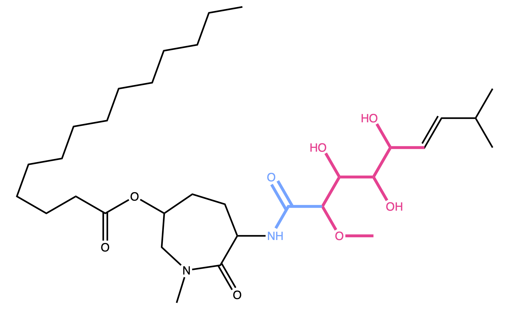
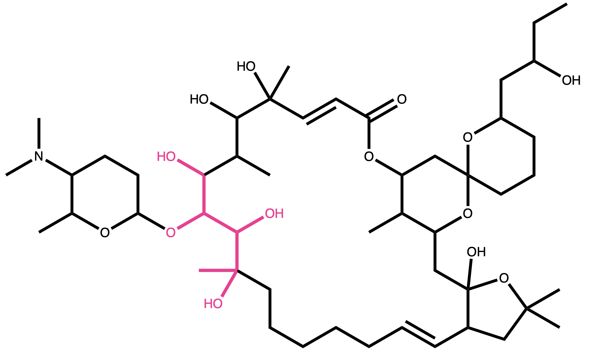
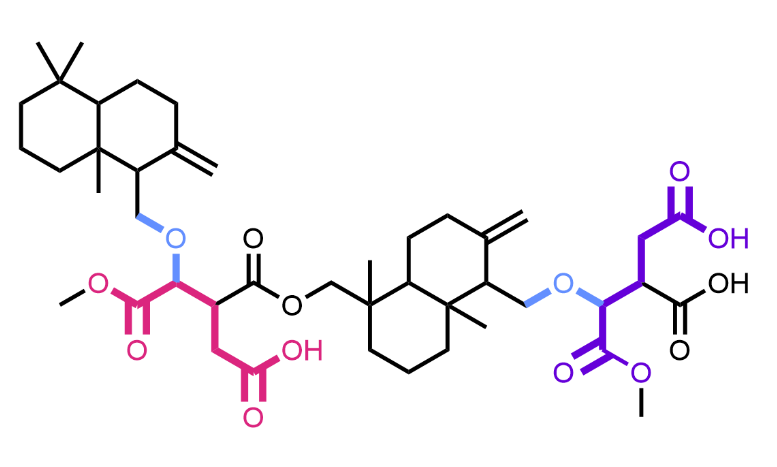
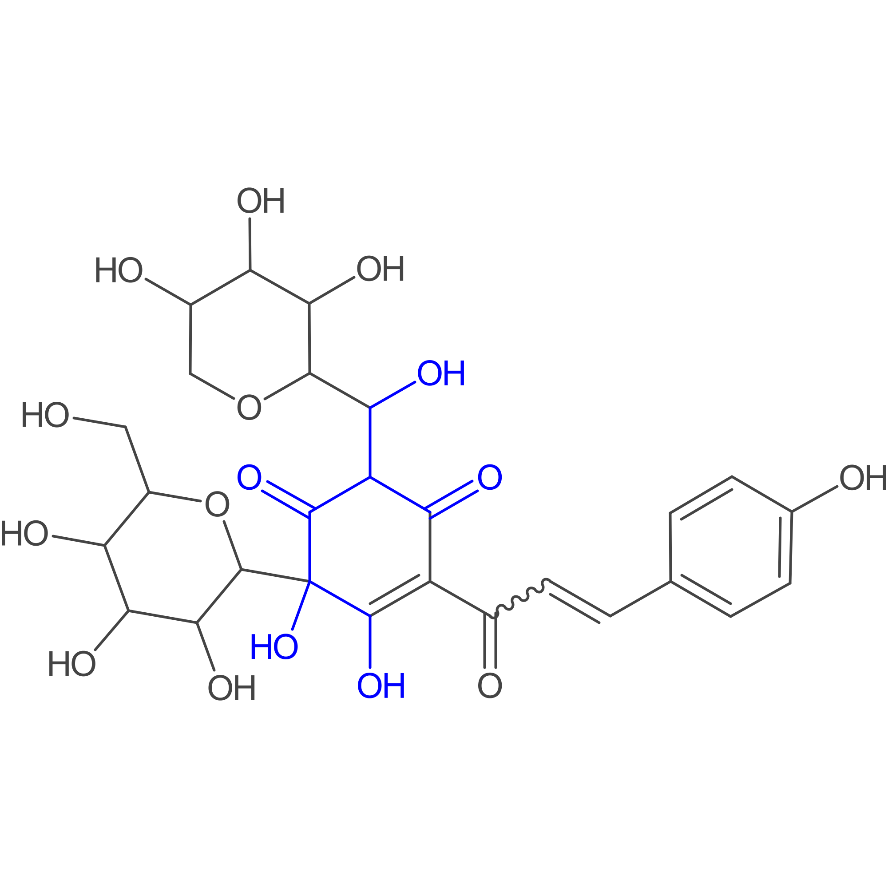
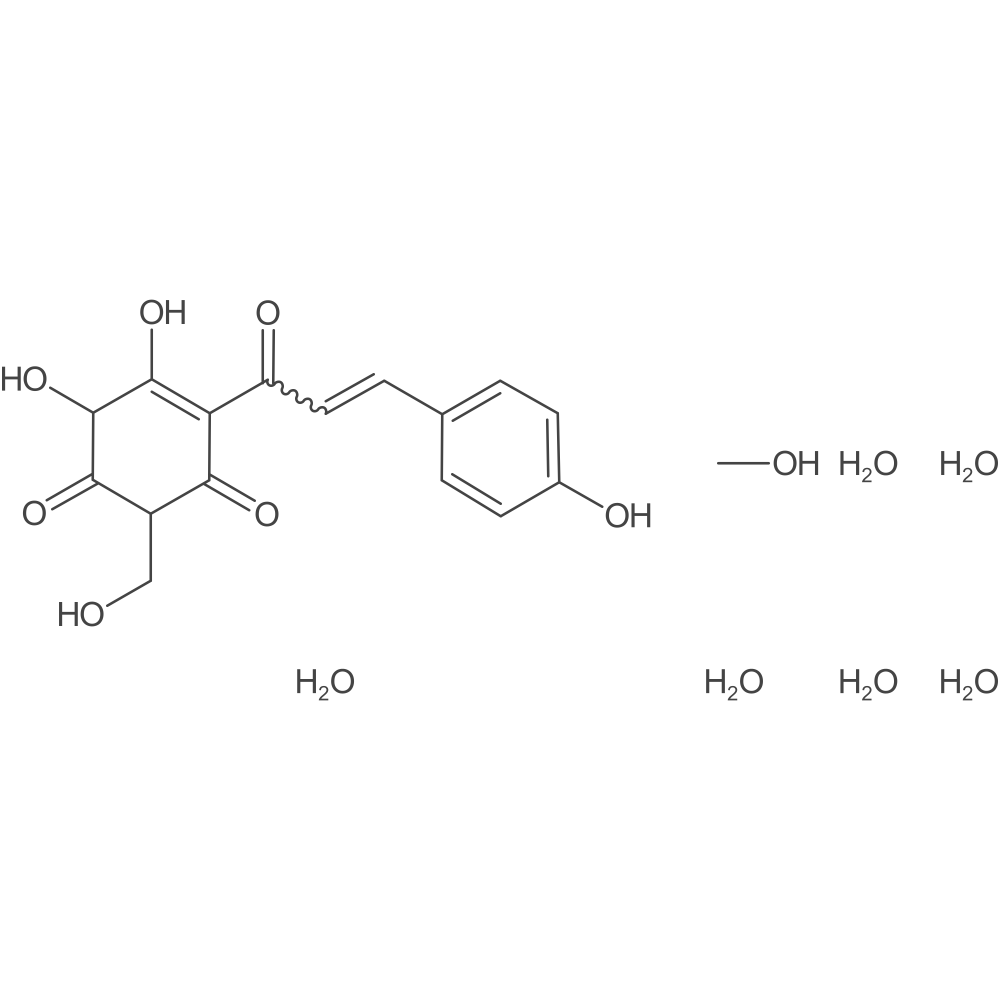

# Sugar Removal Utility (SRU)
##### An algorithmic approach for <i>in silico</i> removal of circular and linear sugars from molecular structures

## Contents of this document
* [Description](#Description)
* [Additional notes on deglycosylation and the SRU](#Additional-notes-on-deglycosylation-and-the-SRU)
  * [New option for keto groups on circular sugars](#New-option-for-keto-groups-on-circular-sugars)
  * [What is a sugar and what is not a sugar?](#What-is-a-sugar-and-what-is-not-a-sugar?)
  * [One known pitfall of the algorithm](#One-known-pitfall-of-the-algorithm)
* [Contents of this repository](#Contents-of-this-repository)
  * [SugarRemovalUtility CMD App](#SugarRemovalUtility-CMD-App)
  * [Natural product test set](#Natural-product-test-set)
  * [Sources](#Sources)
* [Installation](#Installation)
  * [Command line application JAR](#Command-line-application-JAR)
  * [Source code](#Source-code)
* [Dependencies](#Dependencies)
* [References and useful links](#References-and-useful-links)

## Description
Here, we present source code and examples for the Sugar Removal Utility, an algorithmic approach for <i>in silico</i> 
removal of circular and linear sugars from molecular structures, as described in [Schaub, J., Zielesny, A., Steinbeck, 
C. et al. Too sweet: cheminformatics for deglycosylation in natural products. J Cheminform 12, 67 (2020). 
https://doi.org/10.1186/s13321-020-00467-y](https://doi.org/10.1186/s13321-020-00467-y). 
 The algorithm's implementation is available in three forms: As a web application, a command-line application, and
as source code readily usable for other software development projects. Every form is open and free to use. The web 
application is available at [https://sugar.naturalproducts.net](https://sugar.naturalproducts.net) and its source code 
can be found [here](https://github.com/mSorok/SugarRemovalWeb). The command-line application along with its source code 
and the sugar removal algorithm's main implementation are part of this repository.

Further description on the implemented sugar removal algorithm and its various configurations can be found in the article
named above.
 The Sugar Removal Utility is also available in the open Java rich client application MORTAR ('MOlecule fRagmenTation fRamework')
where <i>in silico</i> molecule fragmentation can be easily conducted on a given data set and the results visualised
([MORTAR GitHub repository](https://github.com/FelixBaensch/MORTAR), [MORTAR article preprint](https://doi.org/10.26434/chemrxiv-2022-zgg8s)).

## Additional notes on deglycosylation and the SRU
### New option for keto groups on circular sugars
In version 1.2, a new option has been added to allow the detection (and subsequent removal) of potential circular sugar 
moieties with keto groups. It can be used via the command-line application and the Sugar Removal Utility source code.
 The general rule specified in the original algorithm description (see article) is that every potential sugar cycle 
with an exocyclic double or triple bond is excluded from circular sugar detection. If this option is turned on, an 
exemption to this rule is made for potential sugar cycles having keto groups. Also, the double-bound oxygen atoms will 
then count for the number of connected oxygen atoms and the algorithm will not regard how many keto groups are attached 
to the cycle (might be only one, might be that all connected oxygen atoms are double-bound). If this option is turned 
off, every sugar-like cycle with an exocyclic double or triple bond will be excluded from the detected circular sugars, 
as it is specified in the original algorithm description.
 Per default, this option is turned off. Therefore, nothing changes compared to prior versions when using the default 
settings. In the command-line application, this new option can be configured by using '-circSugKetoGroups' or 
'--detectCircularSugarsWithKetoGroups' as parameter key with a boolean argument. See usage instructions for the 
application for more information.

### What is a sugar and what is not a sugar?
The structural space of sugar moieties and sugar-like moieties is large and diverse, as we show and discuss in our 
second SRU article where we use the tool to identify and analyse glycosidic residues in the NP database COCONUT 
([Description and Analysis of Glycosidic Residues in the Largest Open Natural Products Database. Biomolecules 2021, 11, 486.](https://doi.org/10.3390/biom11040486)).
The SRU with its default configuration is able to detect a large proportion of this diversity. However, since these parameters 
are designed to identify redundant structures potentially obstructing analysis of the NP aglycone for <i>in silico</i> 
removal, they are deliberately limited to not include the whole diversity of glycosidic structures.
On the other hand, already with its default settings, the SRU may detect structures as sugar moieties that may have a different
biosynthetic origin or may be derived from sugars but have been reduced/oxidized. This appears to be more prevalent in the
case of linear sugar detection. Examples can be found in the [first SRU article](https://doi.org/10.1186/s13321-020-00467-y) *:

* Figure 1 d: The detected linear sugar in bengamide B highlighted in the figure is most likely derived from glycerol.
  
  

* Figure 9 a: The detected linear sugar in ossamycin highlighted in the figure is most likely derived from a polyketide 
  pathway. Note that to detect this moiety, the default settings have to be altered, i.e. the detection of linear sugars 
  in rings has to be activated. 
  
  

* Figure 17 c: The detected linear sugars in cryptoporic acid F highlighted in the figure are most likely derived from
  isocitric acid.
  
  
This raises the question of what should be defined as a “true” sugar moiety that was likely added 
during a glycosylation event, and what would rather be a “sugar-like” moiety that more likely comes from a metabolic 
pathway unrelated to carbohydrates. The SRU algorithm with its sugar detection functions is not intended to answer this 
question but, as stated above, was designed to identify redundant structures potentially obstructing analysis of the NP 
aglycon for <i>in silico</i> removal. However, one important feature of the SRU is its configurability, which allows the 
adaption of it for various applications and queries. Depending on what you, the user, want to achieve, the SRU configurations
can be altered to (hopefully) best apply it to your problem. To help with that, the two named articles about the SRU provide
details about the different configuration options of the SRU and example structures that are or are not detected, depending 
on the chosen settings. And should you have more questions, do not hesitate to contact us. 
 
 * The authors would like to thank 
[Dr. Christine Beemelmanns](https://www.leibniz-hki.de/en/institut-staff-details.html?member=87)
for pointing out these examples and discussing them with us. 

### One known pitfall of the algorithm
In a few cases, the detection of a linear sugar candidate can fail after the circular sugars are removed from the molecule. 
The particular linear sugar is in most cases part of a ring and detected when the molecule still has its original structure.
After removing the circular sugars, the linear sugar is not detected anymore. This is due to the linear sugar patterns 
not matching anymore without the adjunct circular sugar.
 One example for this is the COCONUT NP CNP0154212 (see Figure 1). Here, a linear sugar (in blue) can be detected, 
when the option to detect linear sugars in cycles is turned on (per default, it is turned off). After the circular sugar 
moieties are removed, the structure that was detected as a linear sugar before is not detected anymore, although it is 
still intact (see Figure 2).
 More examples are documented in the test method SugarRemovalUtilityTest.specificTest35WithDepiction(). 

**Figure 1.** In the COCONUT NP CNP0154212, a linear sugar (in blue) can be detected, when the option to detect linear 
sugars in cycles is turned on (per default, it is turned off).

**Figure 2.** After the circular sugar moieties are removed from CNP0154212 in Figure 1, the structure that was detected 
as a linear sugar before is not detected anymore, although it is still intact. In this figure, the disconnected small 
fragments resulting from the circular sugar removal are not cleared away as they would be with the default options, to
show the whole picture of the remaining structure. 

## Contents of this repository
### SugarRemovalUtility CMD App
The sub-folder "SugarRemovalUtility CMD App" contains the sugar removal command-line application downloadable as 
compressed archive. After decompression, the JAR file "SugarRemovalUtility-jar-with-dependencies.jar" can be executed
from the command-line using Java version 11 or higher. A detailed explanation how to use the application can be found in
"Usage instructions.txt". Also, an example input file is provided, named "smiles_test_file.txt".

### Natural product test set
The text file "hand_picked_np.txt" contains a list of SMILES codes serving as a natural product test set for the 
performance of the SugarRemovalUtility. They were hand-picked from public databases via the 
[COlleCtion of Open NatUral producTs (COCONUT)](https://coconut.naturalproducts.net). More details can be found in the 
test class (see below) and the [Sugar Removal Utility publication](https://doi.org/10.1186/s13321-020-00467-y).

### Sources
In the directory <i>/src/main/java/de/unijena/cheminf/deglycosylation/</i> the class <i>SugarRemovalUtility</i> can be found.
This class represents the stand-alone implementation of the sugar removal algorithm. It can be used to detect and remove 
circular and linear sugar moieties from molecules supplied as CDK IAtomContainer objects with many configurable options.
Further documentation can be found in its JavaDoc comments.
The other sources available in <i>/src/main/java/de/unijena/cheminf/deglycosylation/</i> belong to the command-line 
application. It makes the various settings for fine-tuning the sugar detection and removal process available through the
command-line arguments. But using the <i>SugarRemovalUtility</i> class directly in your own software project offers some
additional configuration options and functionalities:
* Adding and removing circular and linear sugar patterns for the initial detection steps
* Sugar detection without removal
* Detecting only the number of sugar moieties of a molecule
* Extracting the detected or removed sugar moieties from a molecule
* Selecting the biggest or heaviest fragment from an unconnected atom container (e.g. after removal of non-terminal sugars)
* Partitioning and sorting unconnected fragments of an unconnected atom container

The class <i>SugarRemovalUtilityTest</i> can be found in the directory 
<i>/src/test/java/de/unijena/cheminf/deglycosylation/</i>. It is a JUnit test class that tests the performance of the 
Sugar Removal Utility on multiple specific molecular structures of natural products hand-picked from public databases 
(see above). Code examples of how to use and configure the <i>SugarRemovalUtility</i> class can be found here.

## Installation
### Command line application JAR 
The command-line application JAR has to be downloaded and decompressed. After that, it can be executed from the command-line
as described in the usage instructions. Java version 17 or higher has to be installed on your machine.

### Source code
This is a Maven project. In order to use the source code for your own software, download or clone the repository and 
open it in a Maven-supporting IDE (e.g. IntelliJ) as a Maven project and execute the pom.xml file. Maven will then take
care of installing all dependencies.

## Dependencies
**Needs to be pre-installed:**
* Java Development Kit (JDK) version 17
  * [Adoptium OpenJDK](https://adoptium.net) (as one possible source of the JDK)
  * Eclipse Public License v2.0
* Apache Maven version 4
  * [Apache Maven](https://maven.apache.org/download.cgi#alpha-4-x-release)
  * Apache License, version 2.0

**Managed by Maven:**
* Chemistry Development Kit (CDK) version 2.9
  * [Chemistry Development Kit on GitHub](https://cdk.github.io/)
  * License: GNU Lesser General Public License 2.1
* JUnit version 5.10.0
  * [JUnit 5](https://junit.org/junit5/)
  * License: Eclipse Public License v2.0
* Apache Commons CLI version 1.4
    * [Apache Commons CLI](https://commons.apache.org/proper/commons-cli/)
    * Apache License, version 2.0

## References and useful links
**Sugar Removal Utility**
* [Schaub, J., Zielesny, A., Steinbeck, C., Sorokina, M. Too sweet: cheminformatics for deglycosylation in natural products. J Cheminform 12, 67 (2020). https://doi.org/10.1186/s13321-020-00467-y](https://doi.org/10.1186/s13321-020-00467-y)
* [Sugar Removal Web Application](https://sugar.naturalproducts.net)
* [Source Code of Web Application](https://github.com/mSorok/SugarRemovalWeb)

**Glycosylation statistics of COCONUT publication (Using the SRU)**
* [Schaub, J., Zielesny, A., Steinbeck, C., Sorokina, M. Description and Analysis of Glycosidic Residues in the Largest Open Natural Products Database. Biomolecules 2021, 11, 486. https://doi.org/10.3390/biom11040486](https://doi.org/10.3390/biom11040486)

**Chemistry Development Kit (CDK)**
* [Chemistry Development Kit on GitHub](https://cdk.github.io/)
* [Steinbeck C, Han Y, Kuhn S, Horlacher O, Luttmann E, Willighagen EL. The Chemistry Development Kit (CDK): An Open-Source Java Library for Chemo- and Bioinformatics. J Chem Inform Comput Sci. 2003;43(2):493-500.](https://dx.doi.org/10.1021%2Fci025584y)
* [Steinbeck C, Hoppe C, Kuhn S, Floris M, Guha R, Willighagen EL. Recent Developments of the Chemistry Development Kit (CDK) - An Open-Source Java Library for Chemo- and Bioinformatics. Curr Pharm Des. 2006; 12(17):2111-2120.](https://doi.org/10.2174/138161206777585274)
* [May JW and Steinbeck C. Efficient ring perception for the Chemistry Development Kit. J. Cheminform. 2014; 6:3.](https://dx.doi.org/10.1186%2F1758-2946-6-3)
* [Willighagen EL, Mayfield JW, Alvarsson J, Berg A, Carlsson L, Jeliazkova N, Kuhn S, Pluska T, Rojas-Chertó M, Spjuth O, Torrance G, Evelo CT, Guha R, Steinbeck C, The Chemistry Development Kit (CDK) v2.0: atom typing, depiction, molecular formulas, and substructure searching. J Cheminform. 2017; 9:33.](https://doi.org/10.1186/s13321-017-0220-4)
* [Groovy Cheminformatics with the Chemistry Development Kit](https://github.com/egonw/cdkbook)

**COlleCtion of Open NatUral producTs (COCONUT)**
* [COCONUT Online home page](https://coconut.naturalproducts.net)
* [Sorokina, M., Merseburger, P., Rajan, K. et al. COCONUT online: Collection of Open Natural Products database. J Cheminform 13, 2 (2021). https://doi.org/10.1186/s13321-020-00478-9](https://doi.org/10.1186/s13321-020-00478-9)
* [Sorokina, M., Steinbeck, C. Review on natural products databases: where to find data in 2020. J Cheminform 12, 20 (2020).](https://doi.org/10.1186/s13321-020-00424-9)
